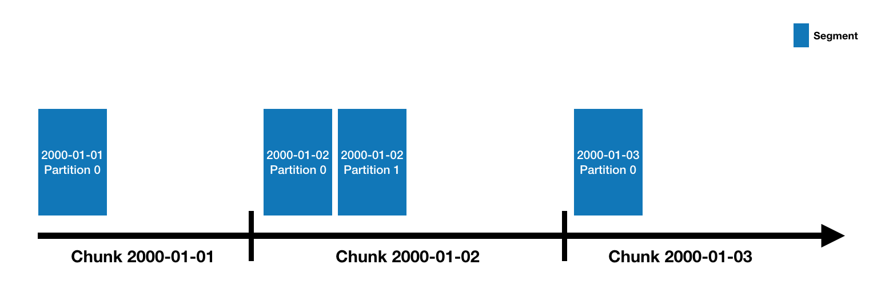
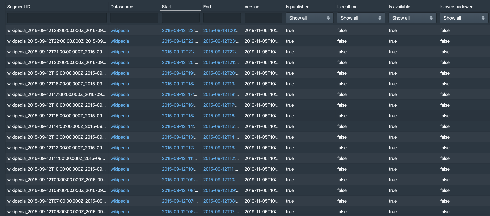

> 스터디를 위해 Apache Druid 공식 문서를 번역/요약한 문서입니다.

# Design


> 출처: [Apache druid - architecture](https://druid.apache.org/docs/latest/design/architecture.html)

Druid는 Multi process로 구성된 분산 아키텍쳐를 가지고 있다. **각 Process는 독립적으로 구성/확장**될 수 있어 클러스터에 맞게 탄력적으로 운영할 수 있다. 이러한 설계는 **하나의 컴포넌트가 일시적으로 사용 불가능한 상태가 되더라도, 다른 컴포넌트에 영향을 미치지 않기 때문에 Fault-tolerance**한 특성도 가지고 있다.

## Processes and Servers

Druid는 다음과 같은 종류의 프로세스들로 구성되어 있다.

* Coordinator: 클러스터의 데이터 가용성을 관리한다.
* Overload: 데이터 수집 작업의 워크로드를 관리한다.
* Broker: 외부 클라이언트의 쿼리를 처리한다.
* Router(Optional): Broker, Coordinator, Overload에게 전달되는 요청을 분산한다.
* Historical: 쿼리 가능한 데이터를 저장한다.
* MiddleManager: 데이터 수집을 수행한다.

## External dependencies

### Deep storage

**모든 Druid 서버가 접근 가능한 공유 파일 저장소**이다. 클러스터 개발 환경에서는 S3나 HDFS가 될 수 있고, NFS가 될 수도 있다. 단일 서버 개발 환경에서는 로컬 디스크를 사용하게 된다. Druid는 Deep storage를 **시스템에서 수집한 모든 데이터를 저장**하는 용도로 사용한다.

Druid는 Deep storage를 **백업**과 백그라운드에서 **Druid 프로세스 간의 데이터 전송** 용도로 사용한다. 

Historical 프로세스는 **쿼리에 응답할 때 Deep storage를 읽지 않고 Historical 프로세스가 동작하는 서버의 로컬 디스크에 저장된 Segment를 읽어 처리**한다. 이는 Druid의 **쿼리 응답성을 높이는데 도움**을 준다. 그러나 Segment 저장을 위해 Historical 프로세스가 동작하는 서버에도 충분한 저장 공간이 필요하다.

### Metadata storage

Segment의 가용성 정보, Task 정보 등을 포함하는 Druid 시스템 메타데이터 저장소이다. MySQL이나 PostreSQL과 같은 RDBMS 시스템이 사용된다. 단일 서버 개발 환경에서는 Apache Derby 데이터베이스를 사용한다.

### Zookeeper

Service Discovery, Coordination, leader election 등을 위해 사용된다.

## Storage design

### Datasources and segments


> 출처: [Apache druid - architecture](https://druid.apache.org/docs/latest/design/architecture.html)

Druid에서 데이터는 RDBMS의 테이블과 유사한 **datasource**라는 곳에 저장된다. 각 datasource는 time 기준으로 파티셔닝되고, 추가적으로 다른 속성들로 파티셔닝 될 수 있다.

각 time 범위는 **chunk** 라고 불린다. chunk는 1개 이상의 **segment**로 구성되어 있다. 각 segmenet는 100만 개 이상의 Row로 구성된 하나의 파일을 의미한다. datasource는 수십, 수백, 수백만개의 segment로 구성될 수 있다.

각 segment는 MiddleManager로부터 생성되며, 첫 생성 시에는 수정 가능(mutable)하며 커밋 되어 있지 않은 상태(uncommitted)이다. Segment는 아래와 같은 과정으로 생성되며, 압축과 빠른 쿼리를 지원할 수 있도록 구조화되어 저장된다.

1. 데이터를 Columnar 포맷으로 변환한다.
2. Bitmap index 기법으로 인덱싱을 수행한다.
3. 다양한 알고리즘으로 압축한다.
   * String 타입 컬럼에 대해서는 Dictionary encoding을 수행한다.
   * Bitmap index를 위해 Bitmap compression을 수행한다.
   * 모든 컬럼에 대해 Type-aware compression을 수행한다.

최종적으로 segment는 커밋(commit)되고 발행(publish)된다. 이 시점에 Deep storage에 써지고 변경 불가능(immutable)해지며, MiddleManager에서 Historical 프로세스로 이동한다. 이후 Segment에 관련된 정보(Schema, Size, Deep storage에서의 위치 등)가 메타데이터 저장소에 기록된다. 이 정보는 Coordinator가 클러스터에서 사용 가능한지 확인하기 위해 필요하다.

### Indexing and handoff

Indexing은 새로운 segment를 만드는 방법이며, Handoff는 생성된 segment를 어떠한 Historical 프로세스에 발행하고 제공할지에 대한 방법이다. 다음은 Indexing의 수행 과정이다.

1. Indexing 작업은 새로운 segment를 생성한다. segment를 생성하기 전에는 이를 구분하기 위한 identifier를 만들게 된다. 
   * 만일 Indexing 작업이 append 타입(kafka task, index task in append mode)인 경우 해당 작업은 Overload의 "allocate"라고 불리우는 API에 의해 수행되며, 기존에 존재하는 segment들에 추가된다.
   * 만일 Indexing 작업이 overwrite타입(hadoop task, index task not in append mode)인 경우, 생성할 segment에 해당하는 Interval에 lock을 걸고, 새로운 version의 segment를 기존 version 위에 덮어쓰게 된다.
2. Indexing 작업이 실시간(realtime) 작업인 경우 segment는 publish되지 않았더라도 즉시 쿼리가 가능하다.
3. Indexing 작업이 segment를 모두 읽어들인 경우 Deep storage에 이를 기록하고, segment 정보를 메타데이터 저장소에 기록하게 된다.
4. 만일 Index 작업이 실시간(realtime) 작업인 경우, Historical 프로세스가 Segment를 적재할 때까지 대기하게 된다. Index 작업이 실시간(realtime)작업이 아닌 경우 Index 작업은 즉시 종료된다.

Coordinator/Historical 에서는 아래와 같은 작업이 수행된다.

1. Coordinator는 메타데이터 저장소로을 주기적(기본 설정: 1분)으로 polling하여 새롭게 발행된 segment를 찾아낸다.
2. Coordinator가 새롭게 발행된 segment를 찾아내었지만 해당 segment가 사용가능한 상태가 아니라면, Historical 프로세스에게 적재(load)를 요청하고 Historical 프로세스는 해당 명령어를 수신한다.
3. Historical 프로세스는 새로운 segment의 적재(load)를 수행하고, 이를 제공(serving)하기 시작한다.
4. 이와 동시에 Indexing 작업은 handoff 작업이 완료되길 기다린 후 종료된다.

### Segment identifiers

```wikipedia_2015-09-12T23:00:00.000Z_2015-09-13T00:00:00.000Z_2019-11-03T07:48:12.036Z```

Segment의 구분자(identifier)는 4개의 부분으로 구성되어 있다.

* Datasource의 이름
* Time interval(segment를 포함하고 있는 Chunk의 Time interval을 의미한다. 이것은 수집 시점에 정의한 segmentGranularity와 일치한다.)
* Version number(segment가 제공되기 시작한 시점의 ISO8601 timestamp)
* Partition number(정수 값이며, **datasource + interval + version이 unique한 값이라면 추가되지 않는다.**, 위의 예제에도 Partition number는 존재하지 않는다. 만일 segment 크기가 너무 크다면 Partitioning이 발생할 것이고, 이에 따라 Partition number가 생성될 것이다.)

### Segment versioning

Segment versioning은 batch-mode-overwriting을 지원하기 위해 존재한다. Druid에서 Append 모드로 데이터를 적재한다면 각 Chunk는 하나의 버전만 존재할 것이다. 그러나 이미 존재하는 데이터(동일한 datasource, time interval)에 대해 Overwrite 모드로 적재한다면 Druid는 새로 적재되는 segment에 기존 segment보다 높은 버전을 부여하고, 기존 segment를 unload하고 새로운 segment를 load할 것이다.

### Segment lifecycle

각 Segment의 생명주기는 아래 3개의 주요 공간에 포함되어 있다.

1. Metadata store: Segment metadata(수 KB 정도의 작은 JSON 파일)가 segment가 생성될 때 메타데이터 저장소에 저장된다. Segment의 메타데이터를 메타데이터에 저장하는 동작을 **Publishing**이라고 한다. 이러한 메타데이터는 ```used```라는 boolean flag를 가지고 있는데, 이는 해당 segment가 쿼리 가능한 데이터인지 아닌지를 판단하는데에 사용된다. 실시간 수집에 의해 생성된 Segment는 더 이상의 추가 데이터가 들어오지 않는 완료된 상태이기 때문에 publish 되지 않더라도 사용될 수 있다.
2. Deep storage: Segment 파일이 생성되면 Deep storage에 추가된다. 이 작업은 메타데이터 저장소에 메타데이터가 publishing 되기 전에 수행된다.
3. Availability for querying: 실시간 작업이나 Historical 프로세스에 의해 쿼리될 수 있는 상태를 말한다.

Segment의 상태 값은 아래와 같다.

* is_published: Segment 메타데이터가 메타데이터 저장소에 publish 되었고, used가 true인 경우 true 값을 가진다.
* is_available: Segment가 실시간 작업이나 Historical 프로세스에 의해 조회 가능한 경우 true 값을 가진다.
* is_realtime: 실시간 작업에서만 조회 가능한 경우에 true 값을 가진다. 실시간 수집 작업에 의해 생성된 datasource의 경우 true 값을 가지고 시작된 후, Segment가 published되고 handoff 되면 false로 변경된다.
* is_overshadowed: Segment가 published(+ used)된 상태인데, 다른 Segment가 publish된 경우 True로 설정된다. is_overshadowed가 true로 설정된 Segment는 자동으로 used가 false로 변경된다.

# 개인 스터디 내용

## 모르는 내용 테스트해보기

### Overwrite(appendToExisting = false)인 경우에는 어떤 상황이 벌어질까?

Druid에서 제공하는 ```wikiticker-2015-09-12-sampled.json``` 파일은 [2015-09-12 00:00:00.000, 2015-09-13 00:00:00.000) 까지의 데이터를 가지고 있다. 이를 Segment granularity = HOUR로 주고 수집하면 24개의 Segment가 생성된다.

Ingestion Task를 만들 때는 appendToExisting이라는 옵션을 주게 되는데, 이 옵션이 DataSource 단위로의 Overwrite인지 Segment 단위의 Overwrite인지 궁금했다.

그래서 이 중 [2015-09-12 00:00:00.000, 2015-09-12 01:00:00.000) 범위에 있는 데이터를 샘플링하여 다시 수집하게 만들면 어떤 상태가 되는지 확인해보았다.

#### Wikiticker-2015-09-12-sampled.json 파일 수집(Segment Granularity = HOUR, [2015-09-12 00:00:00.000, 2015-09-13 00:00:00.000))



* Segment Granularity: HOUR
* Roll Up: False
  
24개의 Segment가 생성되며, 각 속성은 다음과 같은 값을 가진다.

* is_published: true
* is_realtime: false -> 배치 수집이었기 때문에 false 값을 가진다.
* is_available: true -> 수집 이후 시간이 어느정도 지났기 때문에 Historical Process에서 Load를 완료한 상태이기 때문에 true 값을 가진다.
* is_overshadowed: false -> 아직 덮어쓴 데이터가 없기 때문에 false 값을 가진다.

#### [2015-09-12 00:00:00.000, 2015-09-12 01:00:00.000) 데이터 샘플링

```cat wikiticker-2015-09-12-sampled.json | grep "2015-09-12T00" > wikiticker-2015-09-12-00-sampled.json``` 명령어를 통해 샘플링을 진행하였다.

#### Wikiticker-2015-09-12-00-sampled.json 파일 수집(Segment Granularity = HOUR, [2015-09-12 00:00:00.000, 2015-09-12 01:00:00.000), appendToExisting = false)


* Segment Granularity: HOUR
* Roll Up: False
* appendToExisting: True

Segments 상에서는 25개가 보이지만, 00시에 수집된 데이터만 확인해보면 위와 같이 기존 수집했던 데이터는 is_overshadowed가 true로 변경된 것으로 보이는 것을 알 수 있다.

실제로 데이터를 조회해보아도 데이터의 크기는 변하지 않고 그대로인 것을 확인할 수 있다. 즉, Datasource가 아닌 Segment 단위로 덮어쓰는 것을 확인할 수 있었다.

#### Wikiticker-2015-09-12-00-sampled.json 파일 수집(Segment Granularity = HOUR, [2015-09-12 00:00:00.000, 2015-09-12 01:00:00.000), appendToExisting = true)


* Segment Granularity: HOUR
* Roll Up: False
* appendToExisting: False

만일 appendToExisting을 False로 설정하고 수집하면 어떻게 될까?

위와 같이 2개의 Segment가 모두 is_overshadowed = false인 상태로 존재하게 되고, 데이터도 늘어나는 것을 확인할 수 있다. 추가적으로 Version의 경우 첫번째 수집되었던 Segment와 동일하고, Partition 번호가 신규로 Segment ID에 붙게 된다.

## 간단한 코드 구현해보기

### Dictionary Encoding

```java

import org.junit.Assert;
import org.junit.Test;

import java.util.*;

public class DictionaryEncodingTest {

    public static Map<String, List<Integer>> encode(List<String> strs){
        Map<String, List<Integer>> encoded = new HashMap<>();

        for(int i = 0; i< strs.size(); i++){
            if(encoded.containsKey(strs.get(i)))
                encoded.get(strs.get(i)).add(i);
            else {
                List<Integer> rowList = new ArrayList<>();
                rowList.add(i);
                encoded.put(strs.get(i), rowList);
            }
        }
        return encoded;
    }

    @Test
    public void testEncode(){
        String[] fruits = new String[]{"apple", "banana", "mango", "grape", "orange"};
        List<String> sampleStrs = new ArrayList<>();
        for(int i = 0; i < 100; i++)
            sampleStrs.add(fruits[Math.abs(new Random().nextInt()) % 5]);

        Map<String, List<Integer>> encoded = encode(sampleStrs);
        for(Map.Entry<String, List<Integer>> entry: encoded.entrySet()){
            String fruit = entry.getKey();
            List<Integer> rowList = entry.getValue();
            for(Integer rowId: rowList)
                Assert.assertEquals(sampleStrs.get(rowId), fruit);
        }
    }
}

```